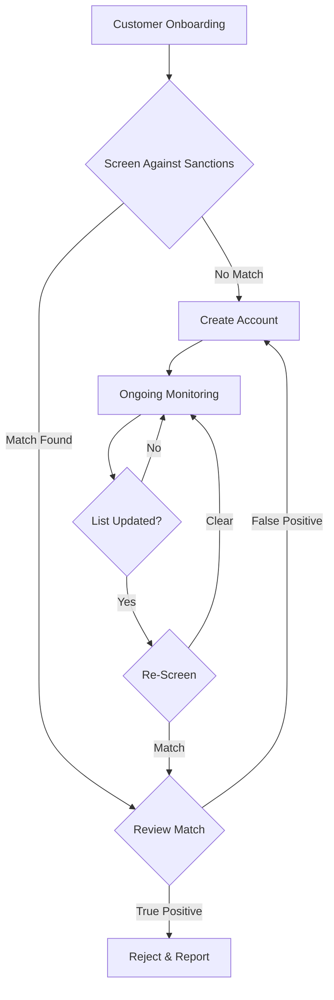

# Compliance & Sanctions Screening

This guide covers compliance best practices for implementing sanctions screening, KYC/KYB workflows, and ongoing monitoring using the Lux Financial API.

## Overview

Regulatory compliance is critical for financial institutions. Lux provides comprehensive tools for:

- **Sanctions Screening**: Real-time screening against 25+ global sanctions lists
- **KYC/KYB Verification**: Identity verification for individuals and businesses
- **Transaction Monitoring**: Automated alerts for suspicious activity
- **Ongoing Monitoring**: Continuous re-screening when sanctions lists update

## Sanctions Screening

### Data Sources

Our sanctions database is synced daily from official government sources:

| Region | Sources |
|--------|---------|
| **United States** | OFAC SDN, OFAC Consolidated, BIS Denied Persons, FinCEN, LEIE, HUD, FHFA, SAM |
| **European Union** | EU FSF, Belgian Financial Sanctions, Dutch DNSL, Lithuanian FIU |
| **United Kingdom** | OFSI Consolidated, FCDO Sanctions |
| **International** | UN Security Council, INTERPOL Red Notices |
| **Asia-Pacific** | Australian DFAT, Singapore MAS, Sri Lanka FIU |
| **Americas** | Canadian SEMA, Argentine REPET, Mexican SAT 69.B |
| **Other** | Swiss SECO, Israeli TOUA, PEP Database |

### Screening Workflow



### Implementation

#### 1. Customer Onboarding

Screen every customer before account creation:

```typescript
import { Lux } from '@lux/sdk';

const lux = new Lux({ apiKey: process.env.LUX_API_KEY });

async function onboardCustomer(customer: CustomerInput) {
  // Step 1: Screen against sanctions
  const screening = await lux.sanctions.screen({
    name: customer.fullName,
    type: 'person',
    dateOfBirth: customer.dateOfBirth,
    country: customer.country,
    sources: ['SDN', 'UN', 'FSF', 'OFSI'], // Core lists
    minScore: 85
  });

  // Step 2: Handle results
  if (screening.matchCount > 0) {
    // Flag for compliance review
    return {
      status: 'pending_review',
      screeningId: screening.id,
      matches: screening.matches
    };
  }

  // Step 3: Create customer (screening passed)
  const newCustomer = await lux.customers.create({
    ...customer,
    sanctionsScreeningId: screening.id
  });

  return { status: 'approved', customer: newCustomer };
}
```

#### 2. Batch Screening

For bulk onboarding or periodic re-screening:

```typescript
async function batchScreenCustomers(customers: Customer[]) {
  const results = await lux.sanctions.screenBatch({
    cases: customers.map(c => ({
      id: c.id,
      name: c.fullName,
      type: c.entityType,
      dateOfBirth: c.dateOfBirth,
      country: c.country
    })),
    sources: ['SDN', 'UN', 'FSF', 'OFSI', 'SECO', 'DFAT'],
    minScore: 80
  });

  // Process results
  const alerts = results.results.filter(r => r.matchCount > 0);

  if (alerts.length > 0) {
    await notifyComplianceTeam(alerts);
  }

  return results;
}
```

#### 3. Transaction Screening

Screen counterparties before processing payments:

```typescript
async function screenTransaction(payment: Payment) {
  // Screen beneficiary
  const screening = await lux.sanctions.screen({
    name: payment.beneficiary.name,
    type: payment.beneficiary.type,
    country: payment.beneficiary.country
  });

  if (screening.matchCount > 0) {
    // Block transaction
    throw new PaymentBlockedError({
      reason: 'sanctions_match',
      screeningId: screening.id,
      matchCount: screening.matchCount
    });
  }

  // Proceed with payment
  return await lux.payments.create(payment);
}
```

#### 4. Ongoing Monitoring

Subscribe to sanctions list updates:

```typescript
// Webhook handler for sanctions updates
app.post('/webhooks/lux', async (req, res) => {
  const event = req.body;

  if (event.type === 'sanctions.sources.updated') {
    // Re-screen all active customers
    const customers = await db.customers.findActive();

    const results = await lux.sanctions.screenBatch({
      cases: customers.map(c => ({
        id: c.id,
        name: c.fullName,
        type: c.entityType
      }))
    });

    // Alert on new matches
    for (const result of results.results) {
      if (result.matchCount > 0) {
        const customer = customers.find(c => c.id === result.id);

        await createComplianceAlert({
          type: 'new_sanctions_match',
          customerId: customer.id,
          screeningResult: result
        });
      }
    }
  }

  res.status(200).send('OK');
});
```

### Match Review Process

When matches are found, the `matchSummary` helps determine if it's a true or false positive:

```typescript
function analyzeMatch(match: SanctionsMatch) {
  const { matchSummary, sanction } = match;

  // Check which fields matched
  const nameMatch = matchSummary.matchFields.find(f => f.fieldName === 'name');
  const dobMatch = matchSummary.matchFields.find(f => f.fieldName === 'dateOfBirth');
  const idMatch = matchSummary.matchFields.find(f => f.fieldName === 'identification');

  // Higher confidence if multiple fields match
  const confidence = calculateConfidence({
    nameMatch,
    dobMatch,
    idMatch,
    score: match.score
  });

  return {
    sanction,
    confidence,
    recommendation: confidence > 90 ? 'likely_true_positive' : 'requires_review',
    matchedFields: matchSummary.matchFields
  };
}
```

## KYC/KYB Verification

### Individual Verification (KYC)

```typescript
async function verifyIndividual(customer: IndividualCustomer) {
  // 1. Document verification
  const docVerification = await lux.kyc.verifyDocument({
    customerId: customer.id,
    documentType: 'passport',
    documentFront: customer.passportImage,
    documentBack: null // Passport doesn't have back
  });

  // 2. Liveness check
  const livenessCheck = await lux.kyc.verifyLiveness({
    customerId: customer.id,
    selfieImage: customer.selfieImage
  });

  // 3. Address verification
  const addressVerification = await lux.kyc.verifyAddress({
    customerId: customer.id,
    documentType: 'utility_bill',
    documentImage: customer.utilityBillImage
  });

  return {
    documentVerification: docVerification.status,
    livenessCheck: livenessCheck.status,
    addressVerification: addressVerification.status,
    overallStatus: calculateKYCStatus([
      docVerification,
      livenessCheck,
      addressVerification
    ])
  };
}
```

### Business Verification (KYB)

```typescript
async function verifyBusiness(business: BusinessCustomer) {
  // 1. Business registry check
  const registryCheck = await lux.kyb.verifyRegistry({
    businessName: business.legalName,
    registrationNumber: business.registrationNumber,
    country: business.country
  });

  // 2. Beneficial owner identification
  const beneficialOwners = await lux.kyb.identifyBeneficialOwners({
    businessId: business.id,
    ownershipThreshold: 25 // 25% ownership
  });

  // 3. Screen beneficial owners against sanctions
  const ownerScreenings = await lux.sanctions.screenBatch({
    cases: beneficialOwners.map(owner => ({
      id: owner.id,
      name: owner.fullName,
      type: 'person',
      dateOfBirth: owner.dateOfBirth
    }))
  });

  return {
    registryStatus: registryCheck.status,
    beneficialOwners,
    ownerScreenings,
    overallStatus: calculateKYBStatus({
      registryCheck,
      ownerScreenings
    })
  };
}
```

## Transaction Monitoring

### Rule-Based Alerts

```typescript
const monitoringRules = [
  {
    name: 'high_value_transaction',
    condition: (tx) => tx.amount > 10000,
    severity: 'medium'
  },
  {
    name: 'high_risk_country',
    condition: (tx) => HIGH_RISK_COUNTRIES.includes(tx.beneficiary.country),
    severity: 'high'
  },
  {
    name: 'velocity_limit',
    condition: async (tx, customerId) => {
      const last24h = await getTransactionCount(customerId, '24h');
      return last24h > 10;
    },
    severity: 'medium'
  },
  {
    name: 'round_amount',
    condition: (tx) => tx.amount % 1000 === 0 && tx.amount > 5000,
    severity: 'low'
  }
];

async function monitorTransaction(tx: Transaction) {
  const alerts = [];

  for (const rule of monitoringRules) {
    if (await rule.condition(tx, tx.customerId)) {
      alerts.push({
        rule: rule.name,
        severity: rule.severity,
        transactionId: tx.id
      });
    }
  }

  if (alerts.length > 0) {
    await createComplianceAlerts(alerts);
  }

  return alerts;
}
```

## Reporting

### Suspicious Activity Reports (SAR)

```typescript
async function generateSAR(alert: ComplianceAlert) {
  const customer = await lux.customers.get(alert.customerId);
  const transactions = await lux.transactions.list({
    customerId: alert.customerId,
    from: alert.periodStart,
    to: alert.periodEnd
  });

  const sar = {
    reportingInstitution: process.env.INSTITUTION_NAME,
    filingDate: new Date().toISOString(),
    subject: {
      name: customer.fullName,
      dateOfBirth: customer.dateOfBirth,
      address: customer.address,
      identificationType: customer.idType,
      identificationNumber: customer.idNumber
    },
    suspiciousActivity: {
      type: alert.type,
      description: alert.description,
      amount: calculateTotalAmount(transactions),
      dateRange: {
        from: alert.periodStart,
        to: alert.periodEnd
      }
    },
    transactions: transactions.map(tx => ({
      date: tx.createdAt,
      amount: tx.amount,
      currency: tx.currency,
      type: tx.type,
      counterparty: tx.beneficiary?.name
    }))
  };

  return sar;
}
```

## Audit Trail

All compliance actions are logged for regulatory examination:

```typescript
// Retrieve compliance audit trail
const auditLog = await lux.compliance.getAuditLog({
  customerId: 'cus_123',
  from: '2025-01-01',
  to: '2026-01-29',
  actions: ['screening', 'kyc_verification', 'alert_review']
});

// Example audit entry
{
  "id": "audit_abc123",
  "timestamp": "2026-01-29T10:30:00Z",
  "action": "sanctions_screening",
  "actor": "system",
  "customerId": "cus_123",
  "details": {
    "screeningId": "scr_xyz789",
    "result": "clear",
    "sourcesChecked": ["SDN", "UN", "FSF"]
  }
}
```

## Best Practices

1. **Screen Early**: Always screen before account creation, not after
2. **Use Multiple Sources**: Don't rely on a single sanctions list
3. **Set Appropriate Thresholds**: Balance false positives vs. missed matches
4. **Document Decisions**: Keep records of all compliance decisions
5. **Monitor Continuously**: Re-screen when lists update
6. **Train Staff**: Ensure compliance team knows how to review matches
7. **Test Regularly**: Validate screening with known sanctioned entities
8. **Stay Updated**: Monitor regulatory changes in your jurisdictions
