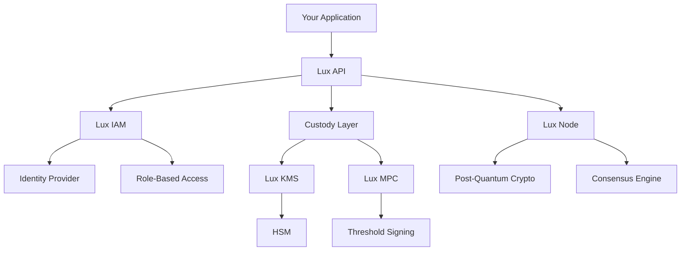

# Infrastructure

Lux Financial provides a vertically integrated infrastructure stack for enterprise-grade banking operations. This includes key management (KMS), multi-party computation (MPC), identity management (IAM), and post-quantum security.

## Architecture Overview



## Lux KMS

Enterprise key management with HSM integration.

### Features

- **HSM Integration**: Support for AWS CloudHSM, Azure Dedicated HSM, Thales
- **Key Rotation**: Automatic key rotation with configurable policies
- **Audit Logging**: Complete audit trail for all key operations
- **Multi-Region**: Global key distribution with regional isolation

### Usage

```typescript
import { LuxKMS } from '@luxbank/kms';

const kms = new LuxKMS({
  region: 'us-east-1',
  hsmProvider: 'aws-cloudhsm',
  clusterArn: process.env.HSM_CLUSTER_ARN,
});

// Generate key
const key = await kms.generateKey({
  type: 'ECDSA_SECP256K1',
  usage: ['sign', 'verify'],
  rotation: '90d',
});

// Sign transaction
const signature = await kms.sign({
  keyId: key.id,
  message: transactionHash,
  algorithm: 'ECDSA_SHA256',
});
```

## Lux MPC

Multi-party computation for self-hosted custody.

### Features

- **Threshold Signing**: 2-of-3, 3-of-5, or custom threshold schemes
- **Key Sharding**: Shamir's Secret Sharing for key distribution
- **Cold Storage**: Offline key generation and signing
- **Recovery**: Social recovery with trusted parties

### Usage

```typescript
import { LuxMPC } from '@luxbank/mpc';

const mpc = new LuxMPC({
  threshold: 2,
  parties: 3,
  keyShareHolders: [
    { id: 'party1', endpoint: 'https://party1.internal' },
    { id: 'party2', endpoint: 'https://party2.internal' },
    { id: 'party3', endpoint: 'https://party3.internal' },
  ],
});

// Generate distributed key
const wallet = await mpc.generateWallet({
  chain: 'polygon',
  currency: 'USDC',
});

// Sign with threshold parties
const signature = await mpc.sign({
  walletId: wallet.id,
  transaction: {
    to: recipientAddress,
    value: amount,
    data: transferData,
  },
});
```

## Lux IAM

Enterprise identity and access management.

### Features

- **SSO Integration**: SAML, OIDC, OAuth 2.0
- **Role-Based Access**: Fine-grained permissions
- **Multi-Factor Auth**: TOTP, WebAuthn, SMS
- **Audit Logging**: Complete access audit trail

### Usage

```typescript
import { LuxIAM } from '@luxbank/iam';

const iam = new LuxIAM({
  domain: 'auth.trianglebank.com',
  ssoProviders: ['okta', 'azure-ad'],
});

// Define roles
await iam.roles.create({
  name: 'treasury_manager',
  permissions: [
    'accounts:read',
    'accounts:write',
    'payments:create',
    'payments:approve',
  ],
  limits: {
    'payments:create': { maxAmount: 1000000 },
  },
});

// Assign user to role
await iam.users.assignRole({
  userId: 'user_123',
  roleId: 'treasury_manager',
});

// Verify permission
const canApprove = await iam.authorize({
  userId: 'user_123',
  action: 'payments:approve',
  resource: 'payment_456',
});
```

## Post-Quantum Security

Future-proof cryptography via Lux Node.

### Features

- **Lattice-Based Crypto**: CRYSTALS-Kyber, CRYSTALS-Dilithium
- **Hash-Based Signatures**: SPHINCS+
- **Hybrid Mode**: Combined classical + post-quantum
- **Migration Path**: Gradual transition to PQ algorithms

### Usage

```typescript
import { LuxNode } from '@luxbank/node';

const node = new LuxNode({
  network: 'mainnet',
  crypto: {
    mode: 'hybrid', // classical + post-quantum
    pqAlgorithm: 'dilithium3',
    classicAlgorithm: 'ecdsa-secp256k1',
  },
});

// Generate post-quantum keypair
const keypair = await node.crypto.generateKeypair({
  algorithm: 'dilithium3',
});

// Sign with hybrid scheme
const signature = await node.crypto.sign({
  message: transactionData,
  keypair,
  mode: 'hybrid',
});
```

## Node Infrastructure

Full blockchain backend with bootnodes.

### Components

| Component | Description |
|-----------|-------------|
| **Bootnode** | Network discovery and peer bootstrapping |
| **Validator** | Consensus participation and block production |
| **Archive** | Full historical data storage |
| **RPC** | JSON-RPC and WebSocket endpoints |

### Deployment

```bash
# Deploy bootnode
lux node deploy --type bootnode --region us-east-1

# Deploy validator
lux node deploy --type validator --stake 100000

# Deploy archive node
lux node deploy --type archive --storage 10tb
```

### Configuration

```typescript
import { LuxNode } from '@luxbank/node';

const node = new LuxNode({
  network: 'mainnet',
  type: 'validator',
  staking: {
    amount: 100000,
    delegationEnabled: true,
  },
  rpc: {
    enabled: true,
    port: 8545,
    cors: ['https://app.trianglebank.com'],
  },
});

await node.start();
```

## Security Best Practices

### Key Management

1. **Never store private keys in plaintext**
2. **Use HSM for production key storage**
3. **Implement key rotation policies**
4. **Maintain secure key backup procedures**

### Access Control

1. **Implement least-privilege principle**
2. **Require MFA for sensitive operations**
3. **Regular access reviews**
4. **Audit all privileged actions**

### Network Security

1. **Use private networks for internal services**
2. **Implement network segmentation**
3. **Enable DDoS protection**
4. **Monitor for anomalous traffic**

## Monitoring & Alerts

```typescript
import { LuxMonitoring } from '@luxbank/monitoring';

const monitoring = new LuxMonitoring({
  services: ['kms', 'mpc', 'iam', 'node'],
  alerts: {
    slack: process.env.SLACK_WEBHOOK,
    pagerduty: process.env.PAGERDUTY_KEY,
  },
});

// Set up alerts
monitoring.alert({
  name: 'high-value-transaction',
  condition: 'transaction.amount > 100000',
  severity: 'warning',
  notify: ['treasury@trianglebank.com'],
});

monitoring.alert({
  name: 'mpc-signing-failure',
  condition: 'mpc.signing.error',
  severity: 'critical',
  notify: ['oncall@trianglebank.com'],
});
```
