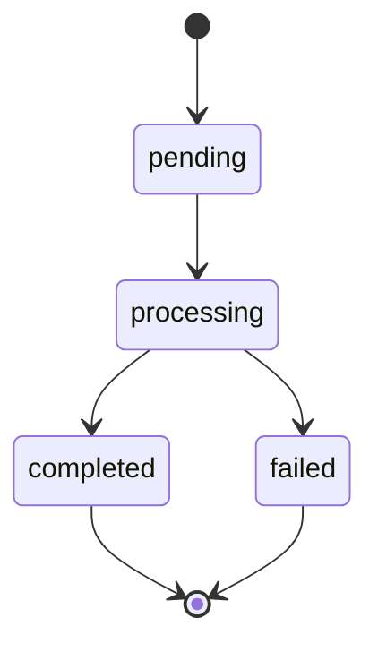

# Payments

Lux Financial supports multiple payment rails for international transfers.

## Supported Rails

| Rail | Currencies | Settlement | Coverage |
|------|-----------|------------|----------|
| SWIFT | 35+ | 1-3 days | Global |
| SEPA | EUR | Same day | EU/EEA |
| Faster Payments | GBP | Instant | UK |
| ACH | USD | 1-2 days | US |
| Wire | USD | Same day | US |

## Creating a Payment

```typescript
const payment = await client.payments.create({
  amount: 100000, // $1,000.00
  currency: 'USD',
  destination: {
    type: 'bank_account',
    beneficiaryName: 'Acme Corp',
    accountNumber: '12345678',
    routingNumber: '021000021',
    bankName: 'Chase Bank',
    bankAddress: {
      country: 'US',
      city: 'New York',
    },
  },
  purpose: 'Invoice payment',
  reference: 'INV-2024-001',
})
```

## Payment Status

Payments transition through the following statuses:



## Webhooks

Subscribe to payment events:

```typescript
// POST /webhooks
{
  "event": "payment.completed",
  "data": {
    "id": "pay_abc123",
    "status": "completed",
    "amount": 100000,
    "currency": "USD"
  }
}
```

## Error Handling

```typescript
try {
  const payment = await client.payments.create(params)
} catch (error) {
  if (error.code === 'insufficient_funds') {
    // Handle insufficient balance
  } else if (error.code === 'invalid_beneficiary') {
    // Handle invalid beneficiary details
  }
}
```
